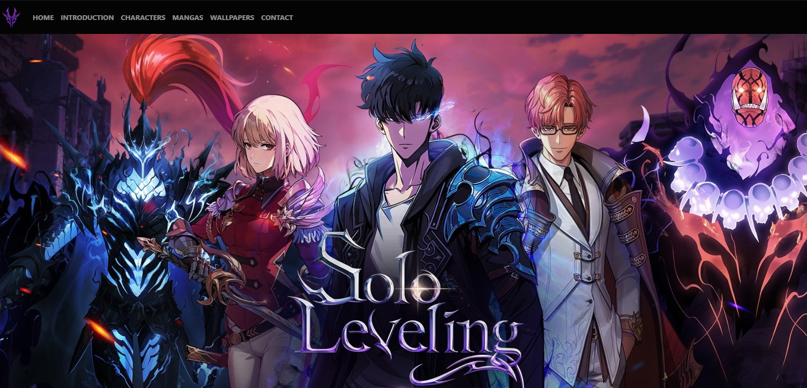
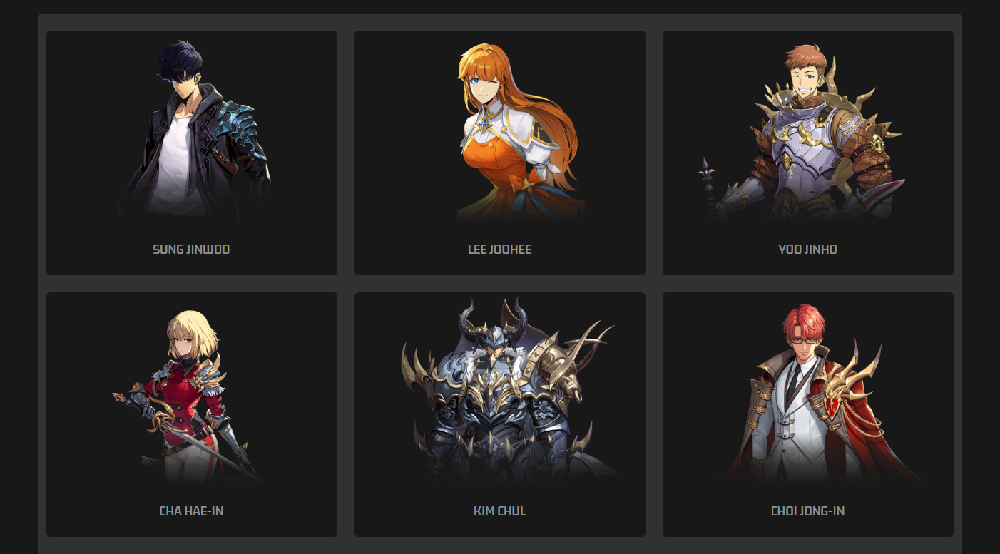
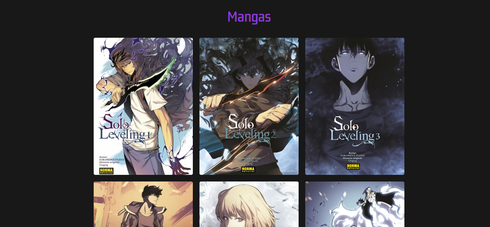
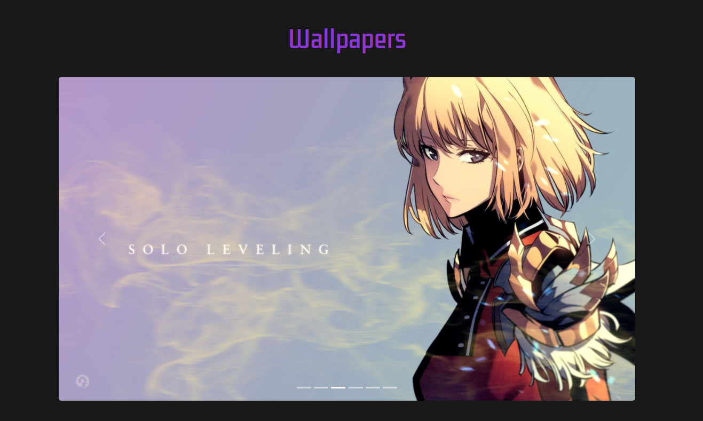

<h1>Memoria del proyecto de Lenguajes de Marcas - 1º DAM/h1>
<h2>Solo Leveling - A tribute site</h2>
<h2>Indice</h2>
<ul>
  <li><a href="#introduccion">Introducción</a></li>
  <li><a href="#motivacion">Motivación</a></li>
  <li><a href="#estructura">Estructura</a></li>
  <li><a href="#estilo">Estilo</a></li>
</ul>

<h2 id="introduccion">Introducción</h2>

Trabajo realizado en clase por: Jorge Bech Castillo

Proyecto de web "from scratch" de 1ª evaluación de Lenguajes de Marcas

Febrero de 2024 

Licencia CC-BY

<h2 id="motivacion">Motivación</h2>

Hice la página de Solo Leveling porque me gustan los diseños de los personajes y la trama me parece interesante. Quiero mostrar lo bueno que es a través de mi página usando principalmente boostrap.

<h2 id="estructura">Estructura</h2>

La web está dividida en  6 secciones:

<ul>
  <li>Hero Section</li>  
  <li>Introducción</li>
  <li>Personajes</li>
  <li>Mangas</li>
  <li>Wallpapers</li>
  <li>Contactos</li>
</ul>
<h3>Hero Section</h3>

He utilizado una imagen de buena calidad que hace buen contraste con los colores

<h3>Introducción</h3>

Esta compuesto de una imagen del personaje principal de la serie y un pequeño texto que explica un poco sobre la historia

<h3>Personajes</h3>

Para hacer esta disposición he utilizado esta especie de galeria-card

<h3>Mangas</h3>

<h3>Wallpapers</h3>

<h3>Contact</h3>

<h2 id="estilo">Estilo de la página</h2>
<h3>Paleta de colores</h3>

He usado tonos negros y morados porque son los colores que caracterizan al protagonista

<h3>Tipografías</h3>

He usado 1: KdamThmorPro-Regular

fuentes obtenidas de:

<ul>
  <li>https://www.1001fonts.com</li>
</ul>
<h3>Imágenes</h3>

Imágenes obteniadas de: https://alphacoders.com

<h2 id="snippets">Code snippets</h2>

He utilizado los siguientes:

<ul>
  <li>Carrousel</li>
  <li>Slider</li>
  <li>Card-gallery</li>
</ul>
